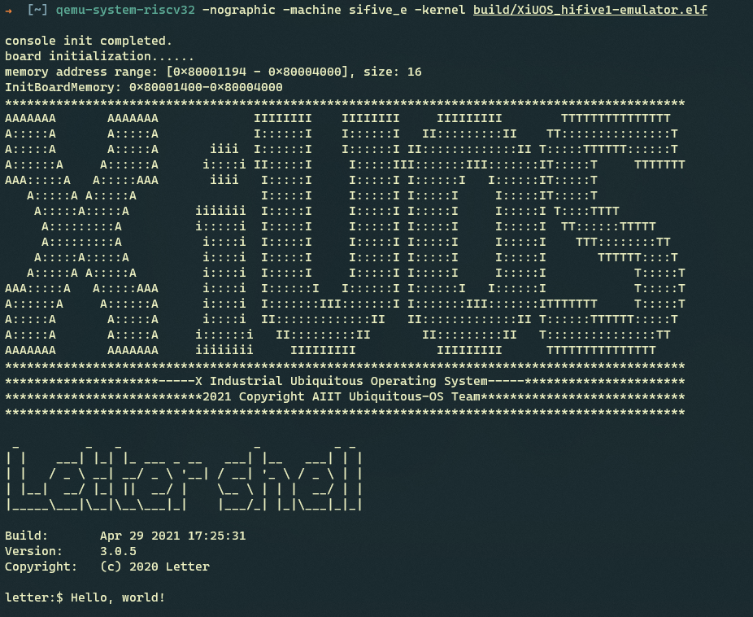

# hifive1 emulator README

## 1. 简介
Q‎EMU 是一个通用的开源模拟器和虚拟化工具。‎从5.0版本开始，Q‎EMU已经可以较完整的支持RISC-V架构，同时支持SiFive的E系列核心。目前XiUOS同样支持运行在Q‎EMU上。

| 硬件 | 描述 |
| -- | -- |
|芯片型号| Hifive1-FE310 |
|架构| RV32IMAC |
|主频| NA |
|片内SRAM| 16KB |
| 外设支持 | UART |

XiUOS板级当前支持使用UART。

## 2. 编译说明

编译环境：Ubuntu18.04

编译工具链：[riscv-none-embed-gcc](https://github.com/ilg-archived/riscv-none-gcc/releases)

编译步骤：

>1.将编译工具链的路径添加到board/hifive1-emulator/config.mk文件当中，例如将gnu-mcu-eclipse-riscv-none-gcc-8.2.0-2.1-20190425-1021-centos64.tgz解压到/opt/下时添加：
```
export CROSS_COMPILE ?=/opt/gnu-mcu-eclipse/riscv-none-gcc/8.2.0-2.1-20190425-1021/bin/riscv-none-embed-
```
>2.在代码根目录下执行以下命令，生成配置文件
```
make BOARD=hifive1-emulator menuconfig
```
>3.在menuconfig界面配置需要关闭和开启的功能，按回车键进入下级菜单，按Y键选中需要开启的功能，按N键选中需要关闭的功能，配置结束后选择Exit保存并退出


>4.继续执行以下命令，进行编译
```
make BOARD=hifive1-emulator
```
>5.如果编译正确无误，会在build目录下产生XiUOS_hifive1-emulator.elf、XiUOS_hifive1-emulator.bin文件。
>注：最后可以执行以下命令，清除配置文件和编译生成的文件
```
make BOARD=hifive1-emulator distclean
```

## 3. 运行

### 3.1 编译并安装Q‎EMU
官网下载Q‎EMU源码编译安装，推荐使用[Q‎EMU v5.2.0](https://download.qemu.org/qemu-5.2.0.tar.xz)版本，如果官网下载速度慢，也可从下面链接下载Q‎EMU v5.2.0源码压缩包[下载地址](https://download.qemu.org/qemu-5.2.0.tar.xz)
```
wget https://download.qemu.org/qemu-5.2.0.tar.xz
tar -xvf qemu-5.2.0.tar.xz
cd qemu-5.2.0
./configure --target-list=riscv32-softmmu
make
sudo make install
```

### 3.2 运行结果

通过以下命令启动Q‎EMU并加载XiUOS ELF文件
```
qemu-system-riscv32 -nographic -machine sifive_e -kernel build/XiUOS_hifive1-emulator.elf
```
QEMU运行起来后将会在终端上看到信息打印输出


### 3.3 调试
利用Q‎EMU可以方便的对XiUOS进行调试，首先通过以下命令启动Q‎EMU
```
qemu-system-riscv32 -nographic -machine sifive_e -kernel build/XiUOS_hifive1-emulator.elf -s -S
```
然后在另一个终端，执行riscv-none-embed-gdb命令
```
riscv-none-embed-gdb build/XiUOS_hifive1-emulator.elf -ex "target remote localhost:1234"
```