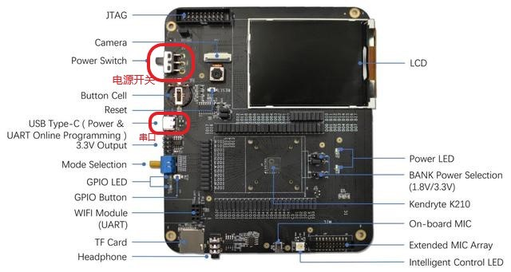
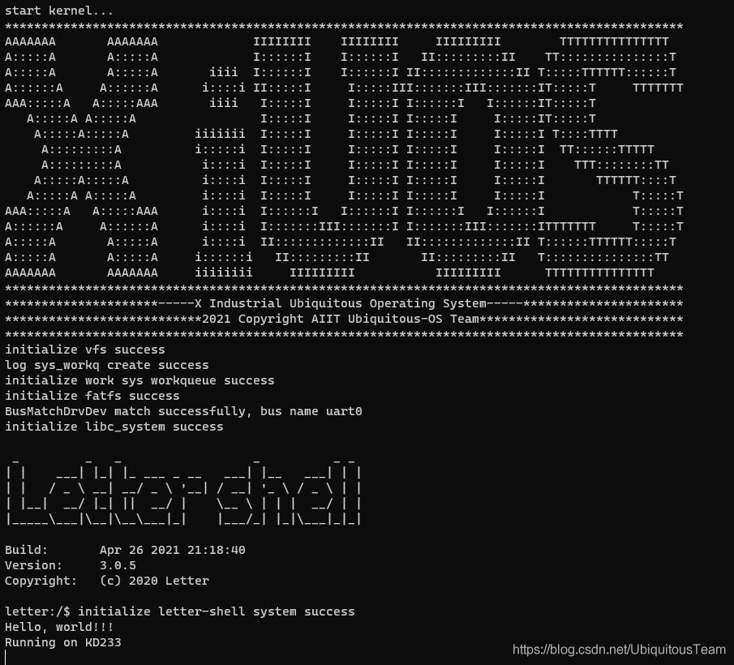

# KD233 README

## 1. 简介

| 硬件 | 描述 |
| -- | -- |
|芯片型号| K210 |
|CPU| 双核RV64GC |
|主频| 400MHz |
|片内SRAM| 8MB |
| 外设 | 内嵌AES与SHA256算法加速器 |
| | DVP、JTAG、OTP、FPIOA、GPIO、UART、SPI、RTC、I²S、I²C、WDT、Timer与PWM |

XiUOS板级当前支持使用GPIO、I2C、RTC、SPI、Timer、UART和watchdog等。

## 2. 编译说明

编译环境：Ubuntu18.04

编译工具链：[riscv-none-embed-gcc](https://github.com/ilg-archived/riscv-none-gcc/releases)

编译步骤：

>1.将编译工具链的路径添加到board/kd233/config.mk文件当中，例如将gnu-mcu-eclipse-riscv-none-gcc-8.2.0-2.1-20190425-1021-centos64.tgz解压到/opt/下时添加：
```
export CROSS_COMPILE ?=/opt/gnu-mcu-eclipse/riscv-none-gcc/8.2.0-2.1-20190425-1021/bin/riscv-none-embed-
```
>2.在代码根目录下执行以下命令，生成配置文件
```
make BOARD=kd233 menuconfig
```
>3.在menuconfig界面配置需要关闭和开启的功能，按回车键进入下级菜单，按Y键选中需要开启的功能，按N键选中需要关闭的功能，配置结束后选择Exit保存并退出
>4.继续执行以下命令，进行编译
```
make BOARD=kd233
```
>5.如果编译正确无误，会产生XiUOS_kd233.elf、XiUOS_kd233.bin文件。其中XiUOS_kd233.bin需要烧写到设备中进行运行。
>注：最后可以执行以下命令，清除配置文件和编译生成的文件
```
make BOARD=kd233 distclean
```

## 3. 烧写及执行

连接开发板串口（即Type-C口）到USB接口，拨动电源开关打开开发板，然后使用K-Flash工具进行烧写bin文件。



执行以下命令安装K-Flash工具
```
sudo apt install python3 python3-pip
sudo pip3 install pyserial
sudo pip3 install pyelftools
sudo pip3 install kflash
```
如果最后一步安装kflash出现错误，可以尝试以下命令
```
sudo python -m pip install kflash
sudo python3 -m pip install kflash
sudo pip install kflash
sudo pip2 install kflash
```
代码根目录下执行K-Flash工具烧录，-p为USB端口号，视实际情况而定
```
kflash -t build/XiUOS_kd233.bin -p /dev/ttyUSB0
```
### 3.1 运行结果

如果编译 & 烧写无误，将会在串口终端上看到信息打印输出。

