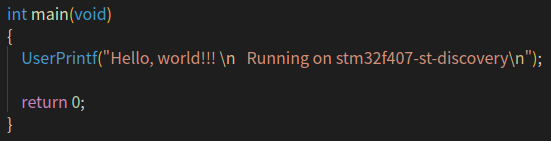
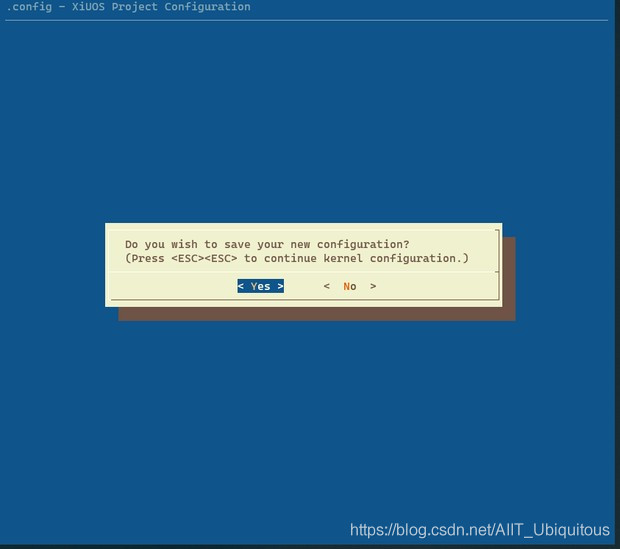
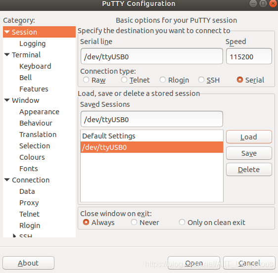
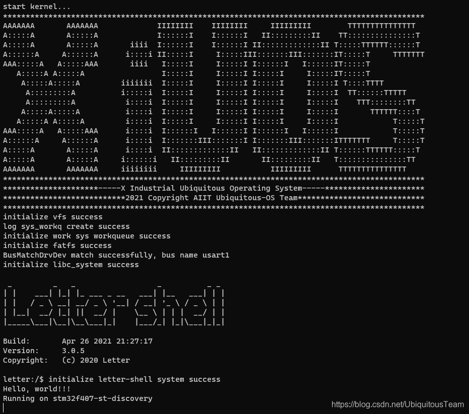

# 从零开始构建矽璓工业物联操作系统：使用ARM架构的STM32F407-discovery开发板

[XiUOS](http://xuos.io/) (X Industrial Ubiquitous Operating System) 矽璓工业物联操作系统是一款面向工业物联场景的泛在操作系统，来自泛在操作系统研究计划。所谓泛在操作系统(UOS: Ubiquitous Operating Systems)，是支持互联网时代人机物融合泛在计算应用模式的新型操作系统，是传统操作系统概念的泛化与延伸。在泛在操作系统技术体系中，不同的泛在计算设备和泛在应用场景需要符合各自特性的不同UOS，XiUOS即是面向工业物联场景的一种UOS，主要由一个极简的微型实时操作系统(RTOS)内核和其上的智能工业物联框架构成，支持工业物联网(IIoT: Industrial Internet of Things)应用。

>注：最新版README请访问[从零开始构建矽璓工业物联操作系统：使用ARM架构的STM32F407-discovery开发板](https://blog.csdn.net/AIIT_Ubiquitous/article/details/116209686)，如博客内容与本地文档有差异，以网站内容为准。

## 开发环境搭建

### 推荐使用：

**操作系统：** ubuntu18.04 [https://ubuntu.com/download/desktop](https://ubuntu.com/download/desktop)

更新`ubuntu 18.04`源的方法:（根据自身情况而定，可以不更改）

第一步:打开sources.list文件

```c
sudo vim /etc/apt/sources.list
```

第二步:将以下内容复制到sources.list文件

```c
deb http://mirrors.aliyun.com/ubuntu/ bionic main restricted universe multiverse
deb http://mirrors.aliyun.com/ubuntu/ bionic-security main restricted universe multiverse
deb http://mirrors.aliyun.com/ubuntu/ bionic-updates main restricted universe multiverse
deb http://mirrors.aliyun.com/ubuntu/ bionic-proposed main restricted universe multiverse
deb http://mirrors.aliyun.com/ubuntu/ bionic-backports main restricted universe multiverse
deb-src http://mirrors.aliyun.com/ubuntu/ bionic main restricted universe multiverse
deb-src http://mirrors.aliyun.com/ubuntu/ bionic-security main restricted universe multiverse
deb-src http://mirrors.aliyun.com/ubuntu/ bionic-updates main restricted universe multiverse
deb-src http://mirrors.aliyun.com/ubuntu/ bionic-proposed main restricted universe multiverse
deb-src http://mirrors.aliyun.com/ubuntu/ bionic-backports main restricted universe multiverse
```

第三步:更新源和系统软件

```c
sudo apt-get update
sudo apt-get upgrade
```

**开发工具推荐使用 VSCode   ，VScode下载地址为：** VSCode  [https://code.visualstudio.com/](https://code.visualstudio.com/)，推荐下载地址为 [http://vscode.cdn.azure.cn/stable/3c4e3df9e89829dce27b7b5c24508306b151f30d/code_1.55.2-1618307277_amd64.deb](http://vscode.cdn.azure.cn/stable/3c4e3df9e89829dce27b7b5c24508306b151f30d/code_1.55.2-1618307277_amd64.deb)

### 依赖包安装：

```
$ sudo apt install build-essential pkg-config  git
$ sudo apt install gcc make libncurses5-dev openssl libssl-dev bison flex libelf-dev autoconf libtool gperf libc6-dev
```

**XiUOS操作系统源码下载：** XiUOS [https://forgeplus.trustie.net/projects/xuos/xiuos](https://forgeplus.trustie.net/projects/xuos/xiuos)

新建一个空文件夹并进入文件夹中，并下载源码，具体命令如下：

```c
mkdir test  &&  cd test
git clone https://git.trustie.net/xuos/xiuos.git
```

打开源码文件包可以看到以下目录：
| 名称 | 说明 |
| -- | -- |
| application | 应用代码 |
| board | 板级支持包 |
| framework | 应用框架 |
| fs | 文件系统 |
| kernel | 内核源码 |
| resources | 驱动文件 |
| tool | 系统工具 |

使用VScode打开代码，具体操作步骤为：在源码文件夹下打开系统终端，输入`code .`即可打开VScode开发环境，如下图所示：

<div align= "center"> 

  </div>

### 裁减配置工具的下载

裁减配置工具：

**工具地址：** kconfig-frontends [https://forgeplus.trustie.net/projects/xuos/kconfig-frontends](https://forgeplus.trustie.net/projects/xuos/kconfig-frontends)，下载与安装的具体命令如下：

```c
mkdir kfrontends  && cd kfrontends
git  clone https://git.trustie.net/xuos/kconfig-frontends.git
```

下载源码后按以下步骤执行软件安装：

```c
cd kconfig-frontends
 ./xs_build.sh
```

### 编译工具链：

ARM： arm-none-eabi(`gcc version 6.3.1`)，默认安装到Ubuntu的/usr/bin/arm-none-eabi-，使用如下命令行下载和安装。

```shell
$ sudo apt install gcc-arm-none-eabi
```

# 在STM32F407-DISCOVERY上创建第一个应用 --helloworld

## 1. 简介

| 硬件 | 描述 |
| -- | -- |
|芯片型号| Stm32F407VGT6|
|CPU|arm cortex-m|
|主频| 168MHz |
|片内SRAM| 192KB |
|片上FLASH| 1MB |
| 外设 | -- |
| | ADC、DAC、USB、GPIO、UART、SPI、SDIO、RTC、CAN、DMA、MAC、I²C、WDT、Timer等 |

XiUOS板级驱动当前支持使用GPIO、I2C、LCD、USB、RTC、SPI、Timer、UART和WDT等。

## 2. 编译说明

### 编辑环境：`Ubuntu18.04`

### 编译工具链：`arm-none-eabi-gcc`
使用`VScode`打开工程的方法有多种，本文介绍一种快捷键，在项目目录下将`code .`输入linux系统命令终端即可打开目标项目

修改`applications`文件夹下`main.c`
在输出函数中写入 `Hello, world!!! \n   Running on stm32f407-st-discovery`完成代码编辑。



编译步骤：

1.在VScode命令终端中执行以下命令，生成配置文件

```c
   make BOARD=stm32f407-st-discovery menuconfig
```

2.在menuconfig界面配置需要关闭和开启的功能，按回车键进入下级菜单，按Y键选中需要开启的功能，按N键选中需要关闭的功能，配置结束后保存并退出（本例旨在演示简单的输出例程，所以没有需要配置的选项，双击快捷键ESC退出配置）


退出时选择`yes`保存上面所配置的内容，如下图所示：



3.继续执行以下命令，进行编译

```c
make BOARD=stm32f407-st-discovery
```

4.如果编译正确无误，会产生XiUOS_stm32f407-st-discovery.elf、XiUOS_stm32f407-st-discovery.bin文件。其中XiUOS_stm32f407-st-discovery.bin需要烧写到设备中进行运行。

## 3. 烧写及执行

将 BOARD=stm32f407-st-discovery开发板SWD经 st-link 转接到USB接口，然后使用st-flash工具进行烧写bin文件。


### 烧写工具

ARM：ST-LINK（ST-LINK V2实物如图，可在购物网站搜索关键字购买）


下载并以下执行命令以下命令安装st-link工具(本文使用v1.5.1版本)，下载地址为：[http://101.36.126.201:8011/stlink.zip](http://101.36.126.201:8011/stlink.zip)

```
sudo apt install libusb-dev
sudo apt install libusb-1.0-0-dev
sudo apt  install cmake
cd stlink
make
cd build/Release && make install DESTDIR=_install
```

将生成的st-flash（在stlink/build/Release/bin文件夹下）复制到/usr/bin下就可使用了

代码根目录下执行st-flash工具烧录

```
sudo st-flash  write  build/XiUOS_stm32f407-st-discovery.bin 0x8000000
```

此外，推荐用户使用putty作为终端工具，安装命令如下：

```c
sudo apt install  putty
```

打开putty配置串口信息

```c
sudo puty
```

选择ttyUSB0（这个端口号根据具体情况而定），配置波特率为115200。



注意：选择正确的终端端口号，最后可以执行以下命令，清除配置文件和编译生成的文件

```c
make  BOARD=stm32f407-st-discovery distclean
```

### 3.1 运行结果

如果编译 & 烧写无误，将会在串口终端上看到信息打印输出，(终端串口引脚为PB6、PB7)。


